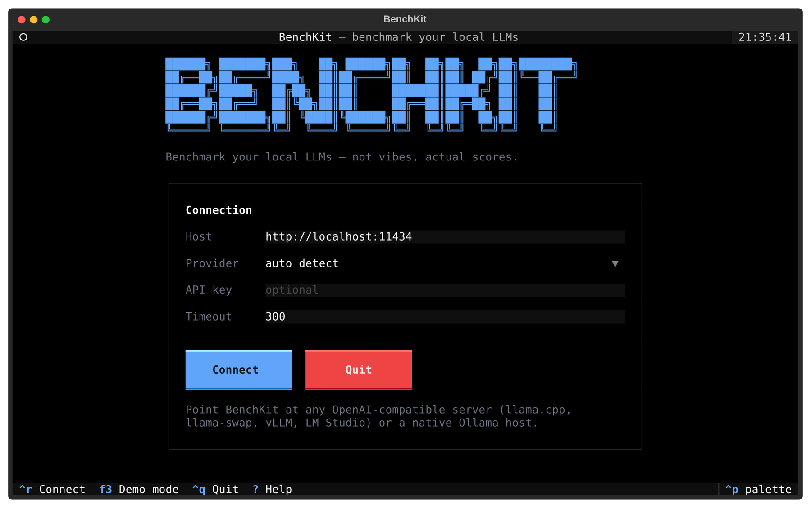
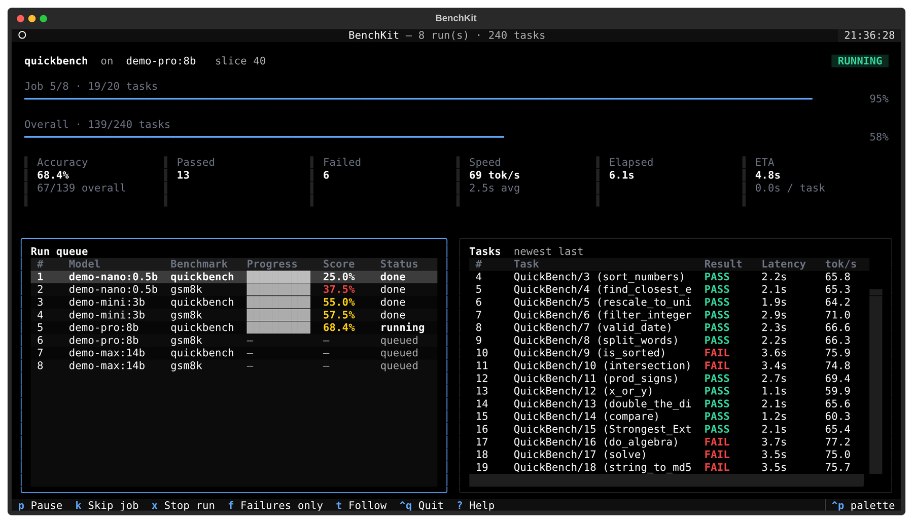

<div align="center">



# BenchKit

**Benchmark local LLMs with real evaluation suites — from a full terminal UI.**

Not vibes. Actual scores.


</div>

---

## Quick start

```bash
uv sync
uv run benchkit
```

No inference server around? Explore the whole interface offline:

```bash
uv run benchkit --demo
```

BenchKit talks to any OpenAI-compatible server — llama.cpp, llama-swap, vLLM,
LM Studio — as well as a native Ollama host.

## The app

<div align="center">
  
</div>

| Screen      | What happens there                                                                                                                                                                                         |
| ----------- | ---------------------------------------------------------------------------------------------------------------------------------------------------------------------------------------------------------- |
| **Connect** | Host, provider, API key and timeout are editable in place. Auto-connects from your `.env`, shows the real error when it fails, retries on `Ctrl+R`.                                                        |
| **Setup**   | Multi-select panes for models and benchmarks with live filters, task counts, global or per-benchmark limits, optional verifier repair, and an optional paired choice-order run. A summary line keeps score: `3 models × 2 benchmarks = 6 runs · 1,240 tasks`. |
| **Run**     | Per-job and overall progress, live accuracy / tok-s / latency / elapsed, streamed thinking/answer phases, loop detection and configurable loop killing, and a task table that updates in place. Pause, skip a job or stop at any point. |
| **Results** | Sortable summary, drill-down into every task with a pass/fail/search filter, and the path to the saved reports.                                                                                            |

Press `Enter` on any task — during the run or afterwards — to watch or read the
exact prompt, reasoning trace and final response.

## Live thinking and loop detection

Benchmark generations are streamed without a BenchKit token cap. The existing
`BENCHKIT_TIMEOUT` remains a hard per-task deadline: on timeout, BenchKit closes
the stream, keeps the partial trace, records a timeout error and continues with
the next task. Doom-loop killing requires a repeated cycle anchored at the live
output suffix, additional generated evidence confirming that the same cycle is
still growing, and a continuous score threshold. By default, the confirmed
cycle must stay at or above 80% for 10 seconds. Global repetition and structural
code similarity remain advisory and cannot kill a task by themselves. The
partial trace is saved as a `LOOP KILLED` task and the benchmark continues. The
explicit **Stop run** action also closes the active stream immediately and keeps
all tasks that finished.

Configure the kill switch and threshold in `.env`:

```env
BENCHKIT_LOOP_KILL=true
BENCHKIT_LOOP_KILL_PERCENT=80
BENCHKIT_LOOP_KILL_SECONDS=10
```

`BENCHKIT_LOOP_KILL` is `true` by default. Set it to `false` to let looping
generations run to completion or to the `BENCHKIT_TIMEOUT` deadline; loop
detection and reporting stay active either way.

When a provider exposes reasoning, BenchKit captures Ollama's `thinking` stream
or an OpenAI-compatible `reasoning_content` stream. Inline `<think>` blocks are
recognized as a fallback. The run screen shows whether the model is waiting,
thinking or answering and continuously analyzes active suffix cycles, repeated
phrases, repeated blocks and low-novelty windows. Once answering starts, an old
thinking cycle is reported as `RECOVERED`/suspected, not counted as a final task
loop, and is no longer actionable. Providers that hide reasoning are reported
as `NO TRACE`, not as models that did no thinking; visible answer loops can
still be identified separately. The live task inspector follows new tokens
while you are at the bottom, then holds your exact scroll position when you
scroll back to read earlier reasoning.

Use `uv run benchkit --demo` for a quick offline check. Demo models emit healthy
and intentionally looping traces so all live states and report fields are easy
to inspect.

## Keys

| Key             | Action                                       |
| --------------- | -------------------------------------------- |
| `?` / `F1`      | Keyboard reference                           |
| `Space`         | Toggle the highlighted model or benchmark    |
| `a` / `n` / `i` | Select all / clear / invert the focused list |
| `l`             | Task limit for the highlighted benchmark     |
| `p`             | Toggle choice-order in setup                  |
| `/`             | Jump to the filter box                       |
| `s` / `F5`      | Start the run                                |
| `p` / `k` / `x` | Pause / skip job / stop during a run         |
| `f`             | Failures only                                |
| `Enter`         | Inspect the highlighted row                  |
| `F2`            | Dogi light / dark                            |
| `Ctrl+P`        | Command palette                              |
| `Ctrl+Q`        | Quit                                         |

Task limits accept `20` (first 20), `-20` (last 20) and `40-80` (a range).

From the setup screen, press `v` or choose **Check templates** to run a quick
chat-template sanity check on the selected models (or every model when none are
selected). This uses llama.cpp/llama-swap's native template and tokenizer
endpoints; other server types are shown as unavailable without blocking a run.

## Headless

For CI and scripts, skip the TUI entirely:

```bash
uv run benchkit --headless --models qwen3:8b,gemma3:12b --benchmarks humaneval:20,gsm8k
uv run benchkit --headless --models all --benchmarks quickbench --verbose
uv run benchkit --headless --models qwen3:8b --tag code
uv run benchkit --headless --models qwen3:8b --benchmarks ruler:5
uv run benchkit --headless --models qwen3:8b --benchmarks mmlu-pro:100 --perturbation choice-order
uv run benchkit --headless --models qwen3:8b --benchmarks gsm8k:20 --harness both
uv run benchkit --headless --models qwen3:8b --benchmarks gsm8k:20 --harness both --repair-attempts 1
uv run benchkit --list
uv run benchkit --list --tag mcq,-saturated
```

`--verbose` prints every prompt, available reasoning trace and response. Reports
are saved exactly as they are from the TUI, and a run that fails part-way still
keeps what finished.

### Direct API vs Pi agent

Use `--harness direct`, `--harness pi`, or `--harness both` to measure the same
model and task with raw next-token generation, the stock Pi coding agent, or a
paired run of both. In the TUI, choose the same modes from the **Harness**
selector. Paired results report the direct score, Pi score, score delta,
loop-kill delta, gains, and regressions. Harness errors on either side are
excluded so both scores use the same item set.

`--repair-attempts 1` is an orthogonal verifier-feedback condition that works
with direct, Pi, and paired harness runs. After an incorrect first answer,
BenchKit returns one sanitized verifier message and accepts one complete
replacement answer. Direct mode makes a second raw request containing the
original exchange. Pi receives a second user turn in the same stock agent
session and keeps its container workspace and native tool history. Reports
retain both attempts and separately show first-attempt score, final score,
repair delta, tasks retried, and successful repairs. The default is
`--repair-attempts 0`, preserving ordinary pass@1 behavior.
With `--harness both --repair-attempts 1`, one run therefore records direct
first/final and Pi first/final scores, plus the initial and final harness score
deltas.

Verifier feedback never includes the expected answer or hidden test bodies.
Exact-match benchmarks receive a generic incorrect/partial-credit message;
bundled Python suites expose only safe categories such as syntax error,
assertion failure, runtime exception type, or timeout. This is called a repair
attempt rather than "2-shot," which normally means examples placed in the
initial prompt.

Pi mode requires a running Docker daemon. At the start of every Pi benchmark
run, BenchKit builds `benchkit-pi:latest` with Docker's build cache disabled and
installs `@earendil-works/pi-coding-agent@latest`. There is deliberately no Pi
version pin: the exact resolved version is recorded in every result and report.
This makes startup slower and makes runs across different dates less
reproducible, but keeps the comparison on Pi's current release as intended. The
image is automatically removed when the benchmark ends, including failed or
cancelled runs.

BenchKit does not replace Pi's system prompt or tool definitions. It starts Pi
in its native RPC mode with its normal `read`, `bash`, `edit`, and `write` tools,
so an agent can create a Python program, execute it, inspect an error, revise
files, and continue its own normal tool loop. This is intentionally different
from adding a calculator call to a raw model request.

The restricted inference proxy records the exact Pi system prompt and advertised
native tool names from the first request actually sent to the model. Reports
persist that prompt, its hash and token count, and show tool calls used versus
tools available. A zero tool-call count therefore means the stock tools were
available but unused for that benchmark item.

Each task receives a fresh, persistent `/workspace` inside a Docker container.
All of that task's agent turns and native tool calls share the workspace; the
container is removed when the task finishes. The task container has no host
mount, Docker socket, or direct network egress. A separate restricted proxy
exposes only the selected inference server's OpenAI-compatible model and chat
routes, keeping the real upstream API key outside the agent container. This
task-environment boundary is also the foundation for adding repository files,
setup commands, and environment-based multi-step suites later.

This boundary isolates Pi's native tool execution. Existing code-suite
verifiers still run through BenchKit's current evaluator; with repair enabled,
the answer-safe result is returned before Pi's optional second turn. Moving
hidden tests into task-specific images is a separate step for future
Terminal-Bench/SWE-bench-style environments.

Pi jobs use the same automatically discovered model-server capacity as direct
jobs, keeping paired runs at matching concurrency. Every active Pi task owns an
agent container and a proxy container, so resource use scales at twice the task
concurrency. The remaining sandbox limits and deadline can be tuned without
changing benchmark definitions:

```env
BENCHKIT_PI_TIMEOUT=900
BENCHKIT_SANDBOX_MEMORY=2g
BENCHKIT_SANDBOX_CPUS=2
BENCHKIT_SANDBOX_PIDS=256
```

`--demo` remains direct-only because it has no real inference endpoint for Pi's
multi-turn requests. Pi's total input/output tokens, assistant turns, native
tool count, tool names/arguments/errors, and resolved Pi version are retained
in JSON and the human-readable reports.

### Choice-order robustness

Use `--perturbation choice-order` to test whether a model keeps solving the
same multiple-choice tasks after their options move to different labels. Each
selected task runs twice: the clean baseline first, followed by a deterministic
permutation whose correct answer is guaranteed to move. BenchKit remaps the
ground-truth letter, pairs the task results, and reports the clean and perturbed
scores, percentage-point delta, regressions and recoveries. Perturbed jobs are
kept out of the overall model score.

Choice order is supported by `arc`, `gpqa`, `hellaswag`, `mmlu`, `mmlu-pro`,
`openbookqa`, `piqa`, `truthfulqa` and `winogrande`. A mixed selection containing
an unsupported benchmark fails before inference rather than silently skipping
it. `uv run benchkit --list` shows support in the **Perturbations** column.

Permutations are stable for the benchmark, task ID and seed. Change the default
seed when you want another ordering:

```bash
uv run benchkit --headless --models qwen3:8b --benchmarks arc:100 \
  --perturbation choice-order --perturbation-seed 7
```

In the TUI setup screen, enable **Run clean + choice-order** (or press `p`) and
optionally change its seed. The plan summary doubles the run and task totals,
unsupported benchmark selections are rejected before inference, and the results
table shows paired score deltas and regressions. The same data is included in
JSON, CSV, Markdown and HTML reports.

### Automatic request concurrency

BenchKit automatically uses every request slot exposed by the active model; no
BenchKit concurrency flag is required. A llama.cpp model started with
`--parallel 4` runs up to four benchmark generations at once, while another
model started with `--parallel 6` uses six when its job runs. The task count is
always the upper bound, so a three-task slice never starts more than three
requests.

Capacity is detected lazily from llama.cpp's `/slots` endpoint. Router mode is
queried with the selected model, and llama-swap is supported through its
per-model `/upstream/<model>/slots` route. Explicit concurrency metadata is
also honored as a cap. Servers that expose neither slots nor a positive
metadata hint safely remain serial, as do Ollama and demo mode. Model jobs
still run one after another so their benchmark numbers do not interfere with
each other; concurrency is applied to the tasks inside the active job.

Pause stops new requests after the active group drains. Skip, stop and Ctrl+C
cancel every request currently in flight. The detected width is shown in the
headless dashboard, TUI run title, CSV/JSON output and Markdown report.

Parallel runs report throughput in three separate forms. Loop kills, timeouts,
length-exceeded generations, and harness errors retain recoverable task token
counts, but aggregate timing uses generations with complete token and timing
payloads and reports the represented request-time share as
`throughput_coverage`. Length-exceeded items remain scored failures; only
genuine harness errors are excluded from scoring and paired comparisons:

- **Aggregate tok/s** is covered output tokens divided by covered job wall time.
  Compare it alongside throughput coverage when a run has terminal items.
- **Stream tok/s** is covered output tokens divided by summed server-reported
  decode time. It describes the speed of an individual generation stream and
  commonly falls as more streams share the same hardware.
- **Effective concurrency** is summed covered request duration divided by
  covered job wall time. For example, a value near `6.0x` with `--parallel 7`
  means roughly six request slots stayed occupied on average.

The TUI leaderboard and aggregate-throughput report charts use aggregate
tok/s. JSON and CSV expose these values as `tok_s_aggregate`,
`tok_s_per_stream` and `concurrency_eff`. The legacy `tok_s` field remains as
an alias for `tok_s_per_stream` so existing report consumers keep working.
The raw denominators are also retained as `total_output_tokens`,
`throughput_output_tokens`, `sum_generation_time`, `sum_request_time`,
`throughput_wall_time`, and `total_time`.

## Performance profiles

Profile a model served by llama.cpp or llama-swap through its OpenAI-compatible
endpoint:

```bash
uv run benchkit perf ornith-35b
```

The default sweep covers minimal, 4k, 16k, 32k and 64k contexts with one
discarded warmup and five measured 128-token generations at each depth. It
reports prompt processing (PP), token generation (TG), time to first token
(TTFT), wall time, proxy/client overhead and the first-request latency that may
include llama-swap model loading. When llama-swap does not expose llama.cpp's
native tokenizer route, BenchKit calibrates deterministic prompt text against
the input-token count reported by the server instead of relying on a fixed
characters-per-token estimate.

Defaults can be narrowed or expanded when needed:

```bash
uv run benchkit perf ornith-35b --depths minimal,4k,16k --gen 256 --reps 10
```

Each run writes `perf.json`, `perf.csv`, `perf.md` and a standalone
`perf.html` dashboard under `results/<timestamp>/`. Add an optional reproducible
configuration line with `BENCHKIT_PERF_CONFIG` in `.env` or `--config-note`;
`BENCHKIT_HARDWARE` is used as a fallback. The first context is measured again
at the end of the sweep to flag GPU warmup or performance drift.

Performance profiles remain throughput-only. Their output includes a reminder
to run `ruler` separately when you also need to know whether the model can use
its configured context effectively; the two result types are not combined.

## Configuration

Copy `.env.example` to `.env` and edit:

```bash
cp .env.example .env
```

```env
BENCHKIT_PROVIDER=openai
BENCHKIT_HOST=http://hub:11434/v1
BENCHKIT_HARDWARE=RTX 3060 12GB
# Optional details shown in performance reports:
BENCHKIT_PERF_CONFIG=RTX 3060 12GB | q8_0 KV | -np 1
```

The `/v1` suffix is optional. BenchKit uses `GET /v1/models` for discovery and
`POST /v1/chat/completions` for benchmark requests. API keys are supported with
`BENCHKIT_API_KEY`. Set `BENCHKIT_PROVIDER=auto` to try OpenAI compatibility
first and fall back to Ollama's native API.

Existing Ollama configuration remains supported:

```env
BENCHKIT_PROVIDER=ollama
OLLAMA_HOST=http://localhost:11434
```

The per-task generation timeout defaults to 300 seconds and can be changed with
`BENCHKIT_TIMEOUT` or on the Connect screen.

Transient API failures — `502`/`503`/`504` from a gateway or model swapper,
`429` rate limits from a busy `llama-server` or a hosted API, and dropped
connections — are retried automatically with exponential backoff (3 attempts,
0.5s doubling up to 8s, plus jitter). When the server answers with a
`Retry-After` header (seconds or an HTTP-date) that wait is honoured instead of
the computed backoff, capped at 60s. Tune it with `BENCHKIT_RETRIES`,
`BENCHKIT_RETRY_BASE_DELAY`, `BENCHKIT_RETRY_MAX_DELAY`, and
`BENCHKIT_RETRY_MAX_WAIT`; set `BENCHKIT_RETRIES=1` to disable retries.
Client errors such as `400`/`404`/`422` are never retried, and a generation that
already streamed tokens is reported instead of replayed so partial output is
never duplicated.

## Benchmarks

| Benchmark  | Key              |  Tasks | Tags                               | What it tests                                                       |
| ---------- | ---------------- | -----: | ---------------------------------- | ------------------------------------------------------------------- |
| QuickBench | `quickbench`     |     20 | code generative smoke              | Tiny Python tasks for a fast end-to-end sanity check                |
| HumanEval  | `humaneval`      |    164 | code generative                    | Python function completion with the original unit tests             |
| HumanEval+ | `humaneval-plus` |    164 | code generative                    | HumanEval with more than 122,000 tougher EvalPlus test inputs       |
| MBPP       | `mbpp`           |    500 | code generative                    | Short Python functions from natural-language specifications         |
| MBPP+      | `mbpp-plus`      |    378 | code generative                    | Sanitized MBPP with more than 39,000 EvalPlus test inputs           |
| GSM8K      | `gsm8k`          |  1,319 | math generative                    | Multi-step grade-school math with exact numeric answers             |
| IFEval     | `ifeval`         |    541 | instruction generative             | Instruction following under constraints a checker can verify        |
| RULER      | `ruler`          | 20 × 6 | long-context retrieval generative  | Multi-key retrieval and variable tracking from 4K through 128K      |
| GPQA       | `gpqa`           |    198 | knowledge mcq low-signal           | Expert-written graduate science questions designed to resist search |
| MMLU-Pro   | `mmlu-pro`       | 12,032 | knowledge mcq                      | Ten-option reasoning questions across 14 categories                 |
| MMLU       | `mmlu`           | 14,042 | knowledge mcq saturated low-signal | Zero-shot coverage of 57 academic and professional subjects         |
| ARC        | `arc`            |  1,172 | knowledge mcq saturated low-signal | Challenging grade-school science multiple choice                    |
| OpenBookQA | `openbookqa`     |    500 | knowledge mcq saturated low-signal | Elementary science requiring factual knowledge and reasoning        |
| WinoGrande | `winogrande`     |  1,267 | commonsense mcq saturated low-signal | Commonsense pronoun resolution in ambiguous sentences             |
| PIQA       | `piqa`           |  1,838 | commonsense mcq saturated low-signal | Physical plausibility of solutions to everyday tasks              |
| BoolQ      | `boolq`          |  3,270 | knowledge mcq saturated low-signal | Yes/no questions answered from evidence in a passage                |
| TruthfulQA | `truthfulqa`     |    817 | knowledge mcq saturated low-signal | Resistance to common misconceptions and false beliefs               |
| HellaSwag  | `hellaswag`      |  1,000 | commonsense mcq saturated low-signal | Plausible continuations of real-world scenarios                   |

More coming soon.

MMLU-Pro is the knowledge suite to reach for first. Ten options per question
drop the random-guess floor from 25% to 10%, and the questions were filtered
for ones that need reasoning rather than recall, so it still separates models
that all sit near MMLU's ceiling. All 12,032 questions is a long run, so slice
it like any other suite (`--benchmarks mmlu-pro:200`). MMLU stays in the
registry for comparability with published numbers.

### Tags

Every benchmark carries tags for what it measures (`code`, `math`,
`knowledge`, `commonsense`, `instruction`, `retrieval`, `long-context`), how it
is answered (`generative`, `mcq`) and how much signal it still carries on the
4-35B models BenchKit targets:

- `saturated` - current models sit near the ceiling, so the suite mostly buys
  comparability with published numbers.
- `low-signal` - the wider bucket: every saturated suite plus GPQA, which is
  the opposite case, since small models sit near the 25% floor and are
  separated just as poorly.

Filter by tag in the picker's filter box or from the CLI, with a leading `-`
to exclude:

```bash
uv run benchkit --list --tag code            # the five code suites
uv run benchkit --list --tag mcq,-saturated  # multiple choice that still moves
uv run benchkit --headless --models qwen3:8b --tag -low-signal
```

In the filter box the same query language applies (`mcq -saturated`), and a
term that is a tag matches tags only, so `code` does not also catch IFEval for
the "code-checkable" in its description. Anything that is not a tag is a plain
text search over keys and descriptions. `--tag` composes with `--benchmarks`,
so `--tag code --benchmarks gsm8k:20` runs both.

IFEval scores strict prompt-level accuracy: a prompt counts as passed only when
every verifiable instruction attached to it is followed. The checkers are a
dependency-free port of the reference implementation, with NLTK tokenization
and `langdetect` replaced by built-in equivalents.

RULER is generated deterministically at runtime—there is no bundled dataset.
Its compact default subset runs ten multi-key retrieval and ten variable-
tracking samples independently at 4K, 8K, 16K, 32K, 64K and 128K. BenchKit
omits buckets above a context limit exposed by the active server; when the
server exposes no limit, all six are offered. Each bucket is a separate job and
report row, and RULER is excluded from overall-score averaging so the
degradation curve stays visible. A slice is applied per bucket: `ruler:5` runs
five samples at every supported length. Long buckets are dominated by prompt
processing and can be very slow on consumer hardware; `benchkit --list` marks
the suite accordingly. The task design follows [NVIDIA RULER][ruler-source]
and its [paper][ruler-paper].

[ruler-source]: https://github.com/NVIDIA/RULER
[ruler-paper]: https://arxiv.org/abs/2404.06654

HumanEval+ and MBPP+ use the complete official EvalPlus datasets and both the
base and expanded test inputs. The upstream datasets are downloaded and cached
on first use. Generated code is untrusted; EvalPlus recommends running its
evaluator in Docker for strong isolation, while BenchKit's integrated runner
uses EvalPlus's guarded local subprocess evaluator for interactive per-task
progress.

## Output

Each run creates a timestamped folder in `results/`:

```
results/2026-03-21_14-30-00/
├── results.json   # Full results with per-task details
├── results.csv    # Summary table
├── results.md     # Markdown table (paste into GitHub)
└── results.html   # Interactive, self-contained visual report
```

Open `results.html` directly in a browser. It carries the same Dogi theme as the
TUI, opens light, and has a toggle in the header. Inside is a gallery of
screenshot-ready charts — overall and per-benchmark accuracy, a full suite
overview, generation loop rate, accuracy versus speed, raw generation speed,
pass/fail composition, total runtime and a score matrix — followed by every
task's prompt, available reasoning, response and loop signals. No server or
external web assets are required.

### Browse historical runs

Open a local dashboard over every completed report in `results/`:

```bash
uv run benchkit history
```

The history view keeps every recorded score as a separate run and exposes its
harness, slice, loop signals, repairs, timeouts, throughput and available
task-level diagnostics. It also reads dedicated `perf.json` profiles. Reports
from older BenchKit versions remain usable; fields that did not exist yet are
shown as not captured rather than zero.

Repeat `--results-dir` to combine archives without copying them into one folder:

```bash
uv run benchkit history \
  --results-dir ./results \
  --results-dir ~/benchkit-hub-results
```

The dashboard binds only to localhost. Use `--no-open` to print its URL without
launching a browser, or `--port PORT` to choose a fixed local port. Reloading the
page rescans the selected directories.

## Adding a benchmark

Create a file in `src/benchkit/benchmarks/` that implements three methods:

```python
class MyBenchmark:
    name = "mybench"

    def load_tasks(self) -> list[Task]: ...
    def build_prompt(self, task: Task) -> str: ...
    def evaluate(self, task: Task, response: str) -> bool: ...
```

Then add it to `REGISTRY` in `benchmarks/__init__.py`. Done.

## Development

```bash
uv sync                     # runtime + dev dependencies
uv run pre-commit install   # ruff on commit, tests on push
uv run ruff check .         # lint
uv run ruff format .        # format
uv run pytest               # tests
```

CI runs lint, the test suite on Python 3.14, an offline `--demo` smoke run
and a package build on every pull request. See [CONTRIBUTING.md](CONTRIBUTING.md).

## License

Apache License 2.0

<div align="center">
<br>
<sub>Themed with <a href="https://github.com/DogukanUrker/DogiZed">Dogi</a> · built on <a href="https://github.com/Textualize/textual">Textual</a></sub>
</div>
